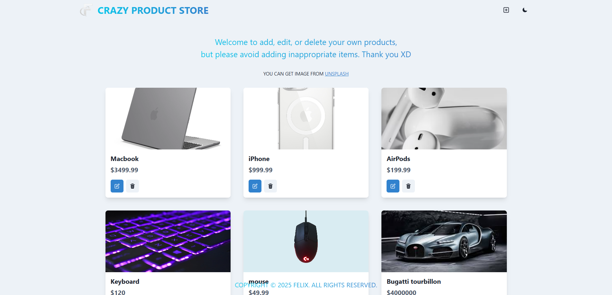

# MERN Stack Image Management App

這是一個基於 **MERN Stack**（MongoDB、Express、React、Node.js）開發的應用，允許用戶新增、修改、刪除圖片，並能夠保存數據，即使重新整理頁面，圖片資訊仍然存在。

## 🌍 部署
此專案已部署於 Render.com，透過以下連結直接訪問：
👉 [https://your-app-name.onrender.com](https://your-app-name.onrender.com)

## ✨ 功能特色
- 使用 **React** 搭建前端框架，提供良好的用戶體驗。
- **Chakra UI** 設計美觀的 UI，並提供 **深色模式** 切換。
- 透過 **Express** 建立 RESTful API，處理 **GET、POST、PUT、DELETE** 等 HTTP 請求。
- 連接 **MongoDB** 數據庫，確保數據的持久化存儲。
- 用戶可以 **新增、編輯、刪除圖片**，包括 **商品名稱、價格、圖片 URL**。
- 部署於 **Render.com**，可直接訪問並使用。

## 🛠 使用技術
- **前端**：React + Chakra UI
- **後端**：Node.js + Express
- **數據庫**：MongoDB（使用 Mongoose 進行數據操作）
- **狀態管理**：React Hooks
- **部署平台**：Render.com


### 建立環境變數檔案 .env

```shell
MONGO_URI=your_mongo_uri
PORT=5000
```

### 本地運行(自動npm install)

```shell
npm run build
```

### 啟動

```shell
npm run start
```


---


